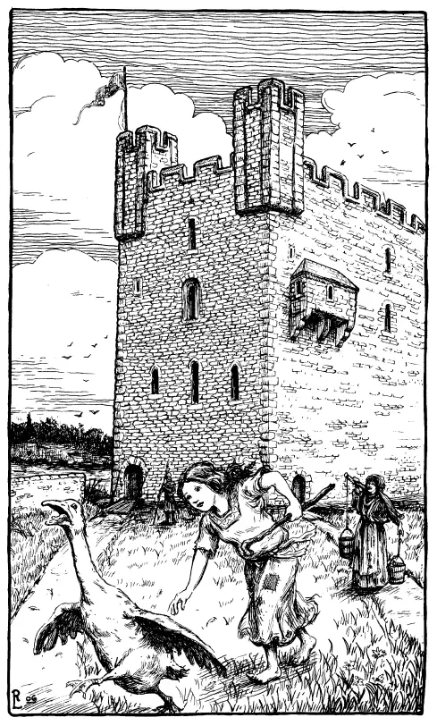
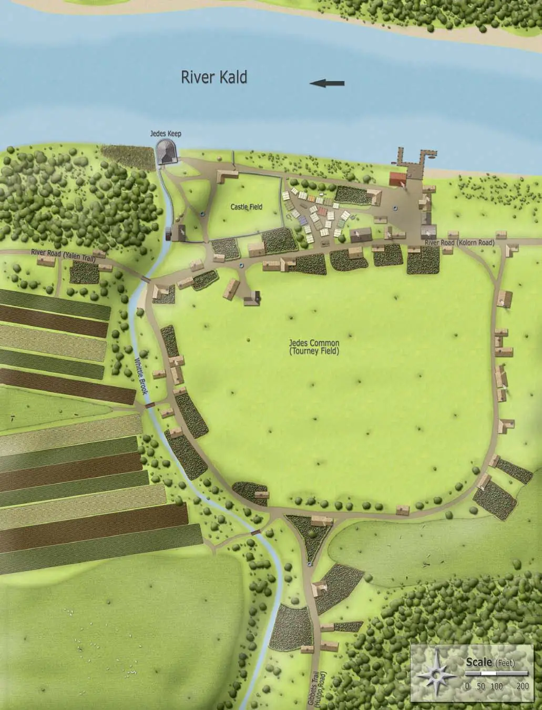
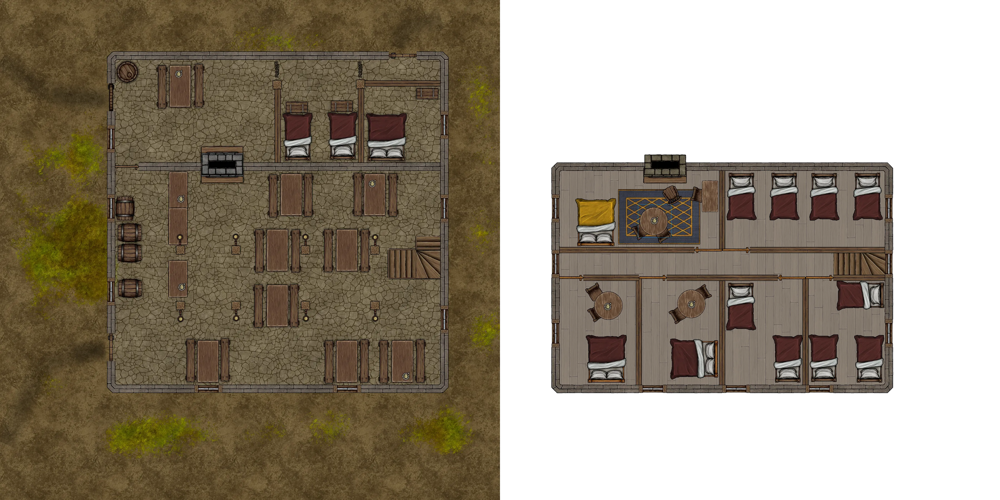
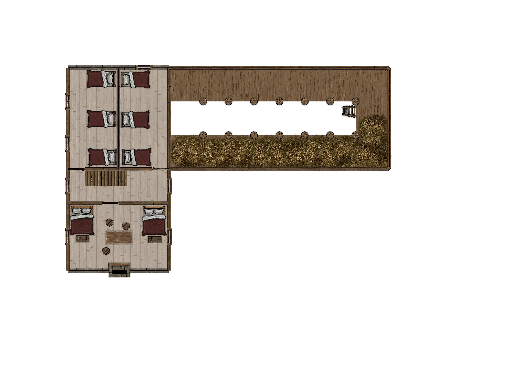
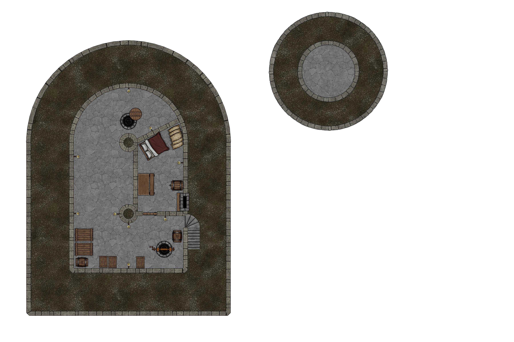
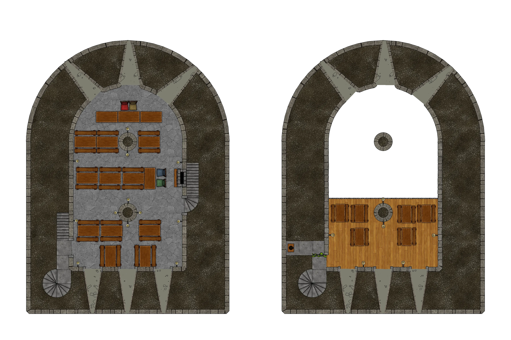
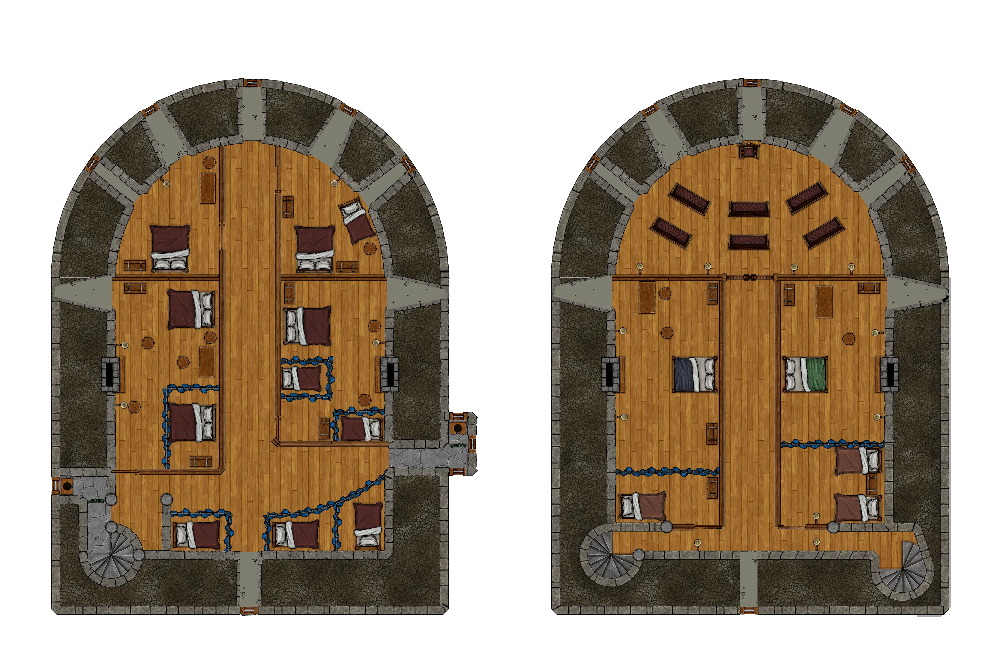
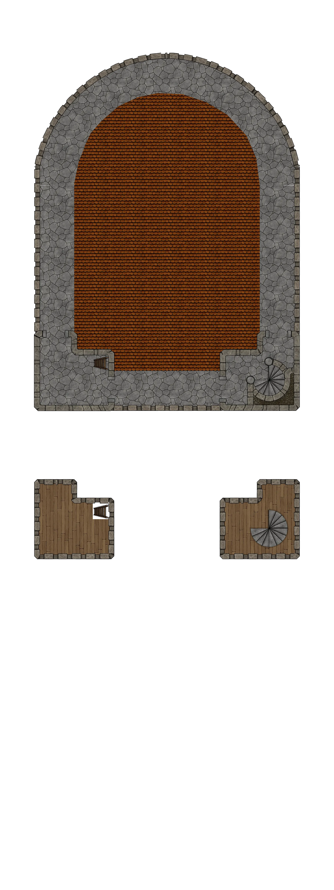

# HârnWorld Location Module: Jedes Keep

[)].download_count&url=https://api.github.com/repos/toastygm/hm-loc-jedes/releases/latest&color=green)](https://github.com/toastygm/hm-loc-jedes/releases/latest)

Jedes keep is a "Location Module" for the Foundry VTT system. It is designed to depict
the Jedes keep in the kingdom of Kaldor, on the island of Hârn in the
[HârnWorld](https://columbiagames.com/harnworld/) fantasy setting; however, this keep
and village could be adapted to exist anywhere in any fantasy setting.

Although designed for use with the [HârnMaster](https://foundryvtt.com/packages/hm3)
system, this module is mostly system-agnostic, with the exception of Actors.
Detailed descriptions of the actors has been provided in journal entries to facilitate
conversion to other game systems.

Jedes is the largest settlement in Asolade Hundred. Consisting of only 49 households,
plus the imposing keep, Jedes lies in the south western edge of Oselshire. This module
details all of the households. This module includes interior plans of the keep, its
outbuildings, and the inn; plus illustrations by Richard Luschek and Juha Makkonen.

Jedes is remote from the politics of central Kaldor. With the majority of settlements run
by a constable for the Earl of Balim, this is one of the Earl’s most important holdings.
It is also a favourite of King Miginath.

Jedes is not a rough frontier settlement, but the last remnant of the ancient Kingdom of
Tarwyn. A land of fertile fields, fat cattle, and sturdy forest ponies, Jedes and the
region is a renowned centre of horse breeding.

# Maps

The original maps from this work have been used as inspiration, and new maps have been
designed specifically to meet the requirements of the VTT environment.  The following
maps are part of this module.

## Jedes Village

Map of Jedes Village, including the keep.

## Fallen Tower Inn

## Castle Field

Ground level.

Upper level.

## Jedes Keep

Cellar and Oubliette.

Ground level.

First floor: Great Hall.

Second floor: Ladies' Gallery.

Third floor: Upper hall and senior retainers.

Fourth floor: Constable's chambers, royal chambers, and chapel.

Roof and towers.

# Credits

This module is made possible by the hard work of Neil Thompson and other HârnWorld fans,
and is provided at no cost. This work is an adaptation of the article
[Jedes](https://www.lythia.com/harnworld/settlements/jedes/) available at the HârnWorld
fan site [Lythia.com](https://www.lythia.com/).

**Writer:** Neil Thompson

**Contributors:**  Matthias Janssen, Daniel Bell, Tim Falkenberg (Horse Fair)

**Original Maps:** Matthias Janssen, Neil Thompson

**Artists:** Richard Luschek, Juha Makkonen

**Editors:** Daniel Bell, Daniele Och

**Adapted to Foundry VTT:** Tom Rodriguez

Thanks to Grant Dalgleish for permission to use the official illustration of Shernath Mirdarne
from the ‘Kaldor Kingdom Module’ and to N. Robin Crossby.

This module is "[Fanon](https://www.lythia.com/about/publishing-fan-written-material/)",
a derivative work of copyrighted material by Columbia Games Inc. and N. Robin Crossby (Kelestia Productions).

Some assets used to create the maps in this module are from
[Forgotton Adventures](https://www.forgotten-adventures.net/).
